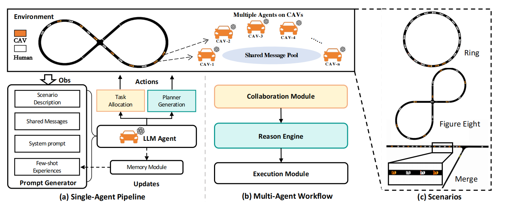

# CoMAL: Collaboration Collaborative Multi-Agent Large Language Models for Mixed-Autonomy Traffic 

[](https://arxiv.org/abs/2410.14368)
[](https://github.com/Hyan-Yao/CoMAL/issues)
[](https://github.com/Hyan-Yao/CoMAL/pulls)

# Paper Abstract
The integration of autonomous vehicles into urban traffic has great potential to improve efficiency by reducing congestion and optimizing traffic flow systematically. In this paper, we introduce **CoMAL** (**Co**llaborative **M**ulti-**A**gent **L**LMs), a framework designed to address the _mixed-autonomy traffic_ problem by collaboration among autonomous vehicles to optimize traffic flow. CoMAL is built upon large language models, operating in an interactive traffic simulation environment. It utilizes a Perception Module to observe surrounding agents and a Memory Module to store strategies for each agent.
The overall workflow includes a Collaboration Module that encourages autonomous vehicles to discuss the effective strategy and allocate roles, a reasoning engine to determine optimal behaviors based on assigned roles, and an Execution Module that controls vehicle actions using a hybrid approach combining rule-based models. Experimental results demonstrate that CoMAL achieves superior performance on the Flow benchmark. Additionally, we evaluate the impact of different language models and compare our framework with reinforcement learning approaches. It highlights the strong cooperative capability of LLM agents and presents a promising solution to the mixed-autonomy traffic challenge.



# Getting Started
In this section we install Flow as well as the binaries and packages needed to support the traffic simulator used in modeling the dynamics of traffic networks: SUMO. 
That is, we need three things: Flow, SUMO, RLlib Ray. Here we don't install the specific version of the benchmark because it's too old and exists lots of bugs. We utilize the latest version of both.

## 1. Install Flow
We begin by creating a conda environment and installing Flow and its dependencies within the environment. This can be done by running the below script. Be sure to run the below commands from /path/to/flow.

```
conda env create -f environment.yml
conda activate flow
python setup.py develop
```

If the conda install fails, you can also install the requirements using pip by calling

```
install flow within the environment
pip install -e .
```

## 2. Install SUMO
SUMO is a traffic simulator. To be able to run SUMO on Linux, just follow these steps:
1. Install all of the required tools and libraries
2. Get the source code
3. Build the SUMO binaries
```
sudo apt-get install git cmake python3 g++ libxerces-c-dev libfox-1.6-dev libgdal-dev libproj-dev libgl2ps-dev python3-dev swig default-jdk maven libeigen3-dev
git clone --recursive https://github.com/eclipse-sumo/sumo
cd sumo
export SUMO_HOME="$PWD"
cmake -B build .
cmake --build build -j$(nproc)
```

## 3. Run CoMAL

After cloning the repository and installing Flow and SUMO, run the following Linux command:

```
python examples/simulate.py [benchmark_name]
```

# Citation
If you find our paper and codes useful, please kindly cite us via:
```
@misc{yao2024comalcollaborativemultiagentlarge,
      title={CoMAL: Collaborative Multi-Agent Large Language Models for Mixed-Autonomy Traffic}, 
      author={Huaiyuan Yao and Longchao Da and Vishnu Nandam and Justin Turnau and Zhiwei Liu and Linsey Pang and Hua Wei},
      year={2024},
      eprint={2410.14368},
      archivePrefix={arXiv},
      primaryClass={cs.AI},
      url={https://arxiv.org/abs/2410.14368}, 
}
```
